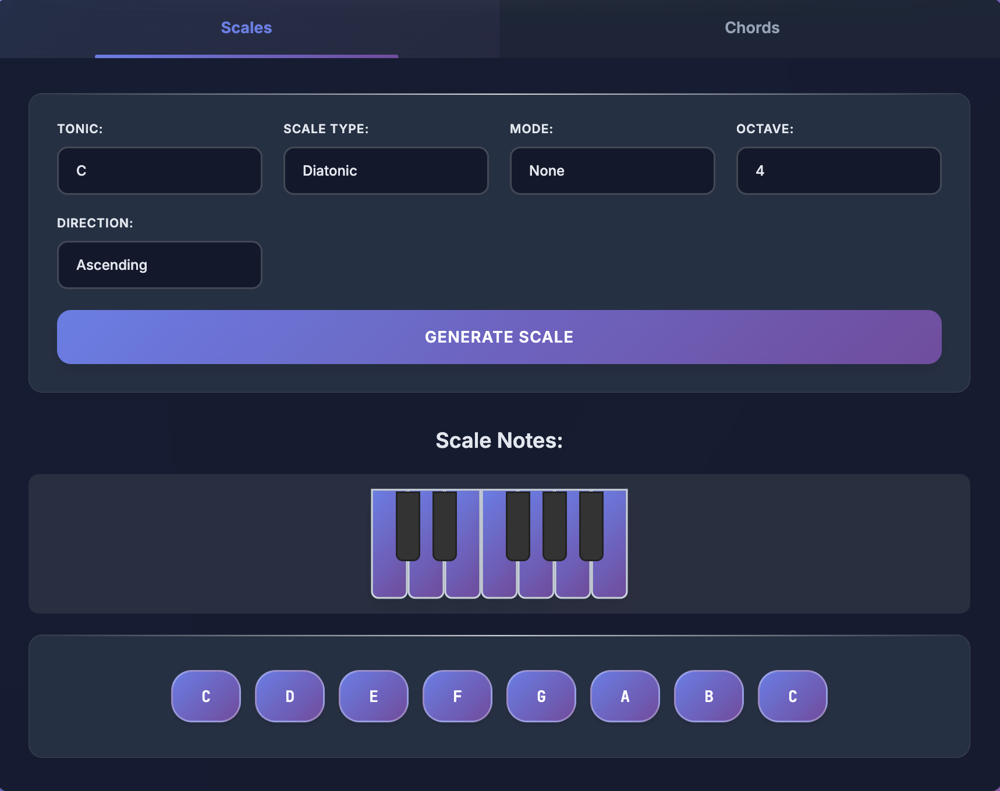

## Rust Music Theory

[](https://travis-ci.com/ozankasikci/rust-music-theory)
[](https://coveralls.io/github/ozankasikci/rust-music-theory?branch=master)
[](https://crates.io/crates/rust-music-theory)
[](https://docs.rs/rust-music-theory)

A library and executable that provides programmatic implementation of the basis of the music theory.
## Table of Contents

- [Overview](#overview)
- [Usage as a Library](#usage-as-a-library)
- [MIDI Support](#midi-support)
- [Usage as an Executable](#usage-as-an-executable)
- [Interactive Playground](#interactive-playground)
- [Building From Source](#building-from-source)
- [Roadmap](#roadmap)

## Overview

`Rust Music Theory` is used to procedurally utilize music theory notions like Note, Chord, Scale,
Interval and more. The main purpose of this library is to let music theory be used in other programs and produce music/audio in a programmatic way.

## Usage as a Library
Add `rust-music-theory` as a dependency in your Cargo.toml.
```toml
[dependencies]
rust-music-theory = "0.3"
```

After installing the dependencies, you can use the library as follows.
```rust
extern crate rust_music_theory as rustmt;
use rustmt::note::{Note, Notes, PitchClass};
use rustmt::scale::{Scale, ScaleType, Mode, Direction};
use rustmt::chord::{Chord, Number as ChordNumber, Quality as ChordQuality};

// to create a Note, specify a pitch class and an octave;
let note = Note::new(PitchClass::As, 4);

// Scale Example;
let scale = Scale::new(
    ScaleType::Diatonic,    // scale type
    PitchClass::C,          // tonic
    4,                      // octave
    Some(Mode::Ionian),     // scale mode
    Direction::Ascending,   // scale direction
).unwrap();

// returns a Vector of the Notes of the scale
let scale_notes = scale.notes();

// Chord Example;
let chord = Chord::new(PitchClass::C, ChordQuality::Major, ChordNumber::Triad);

// returns a Vector of the Notes of the chord
let chord_notes = chord.notes();

```

This is the simplest form of the usage. For detailed examples, please see the tests folder.

## MIDI Support

The library supports MIDI file export and real-time MIDI playback to hardware/software synthesizers.

### MIDI File Export

Enable the `midi` feature to export chords and scales to MIDI files:

```toml
[dependencies]
rust-music-theory = { version = "0.4", features = ["midi"] }
```

```rust
use rust_music_theory::chord::{Chord, Quality, Number};
use rust_music_theory::note::{Pitch, PitchSymbol::*};
use rust_music_theory::midi::{MidiBuilder, MidiFile, Duration, Velocity, Channel};

// Quick export
let chord = Chord::new(Pitch::from(C), Quality::Major, Number::Triad);
chord.to_midi(Duration::Quarter, Velocity::new(100).unwrap())
    .save("chord.mid")?;

// Multi-track composition
let mut builder = MidiBuilder::new();
builder
    .tempo(120)
    .add(&chord, Duration::Whole, Velocity::new(90).unwrap());

MidiFile::new()
    .tempo(120)
    .track(builder, Channel::new(0).unwrap())
    .save("song.mid")?;
```

### Real-Time MIDI Playback

Enable the `midi-playback` feature to play notes on connected MIDI devices (hardware synths, DAWs like Ableton):

```toml
[dependencies]
rust-music-theory = { version = "0.4", features = ["midi-playback"] }
```

```rust
use rust_music_theory::chord::{Chord, Quality, Number};
use rust_music_theory::note::{Pitch, PitchSymbol::*};
use rust_music_theory::midi::playback::{MidiPorts, MidiPlayer};
use rust_music_theory::midi::{Duration, Velocity};

// List available MIDI ports
let ports = MidiPorts::list()?;
for (i, name) in ports.iter().enumerate() {
    println!("{}: {}", i, name);
}

// Connect and play
let mut player = MidiPlayer::connect_index(0)?;
player.set_tempo(120);

let chord = Chord::new(Pitch::from(C), Quality::Major, Number::Triad);
player.play(&chord, Duration::Quarter, Velocity::new(100).unwrap());

// Control Change (filter, modulation, etc.)
player.control_change(1, 64);   // Modulation wheel
player.control_change(74, 100); // Filter cutoff

// Program Change (switch instruments)
player.program_change(0);                    // Piano
player.program_change_with_bank(5, 0, 1);   // Bank 1, program 5

// MIDI Clock (sync with DAW)
player.start_clock();  // Sends clock at 24 PPQ
// ... play notes ...
player.stop_clock();
```

#### Using with Ableton Live

1. **macOS**: Enable IAC Driver in Audio MIDI Setup
2. In Ableton: Preferences → Link, Tempo & MIDI → Enable Track for IAC Driver
3. Create a MIDI track, set input to IAC Driver
4. Run your Rust code - notes play through Ableton's instruments!

For MIDI clock sync, enable "Ext" sync in Ableton's transport.

## Usage as an Executable

`cargo install --git https://github.com/ozankasikci/rust-music-theory`

This lets cargo install the library as an executable called `rustmt`. Some usage examples;

`rustmt scale D Locrian`
```yaml
Notes:
  1: D
  2: D#
  3: F
  4: G
  5: G#
  6: A#
  7: C
  8: D
```
`rustmt chord C# Dominant Eleventh`
```yaml
Notes:
  1: C#
  2: F
  3: G#
  4: B
  5: D#
  6: G
```

`rustmt scale list`
```yaml
Available Scales:
 - Major|Ionian
 - Minor|Aeolian
 - Dorian
 - Phrygian
 - Lydian
 - Mixolydian
 - Locrian
 - Harmonic Minor
 - Melodic Minor
```


`rustmt chord list`
```yaml
Available chords:
 - Major Triad
 - Minor Triad
 - Suspended2 Triad
 - Suspended4 Triad
 - Augmented Triad
 - Diminished Triad
 - Major Seventh
 - Minor Seventh
 - Augmented Seventh
 - Augmented Major Seventh
 - Diminished Seventh
 - Half Diminished Seventh
 - Minor Major Seventh
 - Dominant Seventh
 - Dominant Ninth
 - Major Ninth
 - Dominant Eleventh
 - Major Eleventh
 - Minor Eleventh
 - Dominant Thirteenth
 - Major Thirteenth
 - Minor Thirteenth
```

## Interactive Playground

Try the library in your browser with the interactive WASM playground:

[**https://ozankasikci.github.io/rust-music-theory/**](https://ozankasikci.github.io/rust-music-theory/)



## Building From Source

The binary is implemented as a regex parser cli that returns the notes of the given scale/chord.
To quickly build and run the executable locally;

`git clone http://github.com/ozankasikci/rust-music-theory && cd rust-music-theory`

Then you can directly compile using cargo. An example;

`cargo run scale D Locrian`
```yaml
Notes:
  1: D
  2: D#
  3: F
  4: G
  5: G#
  6: A#
  7: C
  8: D
```

[1]: https://en.wikipedia.org/wiki/Cadence
## Roadmap
- [x] MIDI file export
- [x] Real-time MIDI playback
- [x] MIDI Control Change & Program Change
- [x] MIDI Clock (master mode)
- [x] Properly display enharmonic spelling
- [x] Add inversion support for chords
- [ ] Add missing modes for Melodic & Harmonic minor scales
- [ ] Add support for arbitrary accidentals
- [ ] Add a mechanism to find the chord from the given notes
- [ ] MIDI input (receive from external devices)
